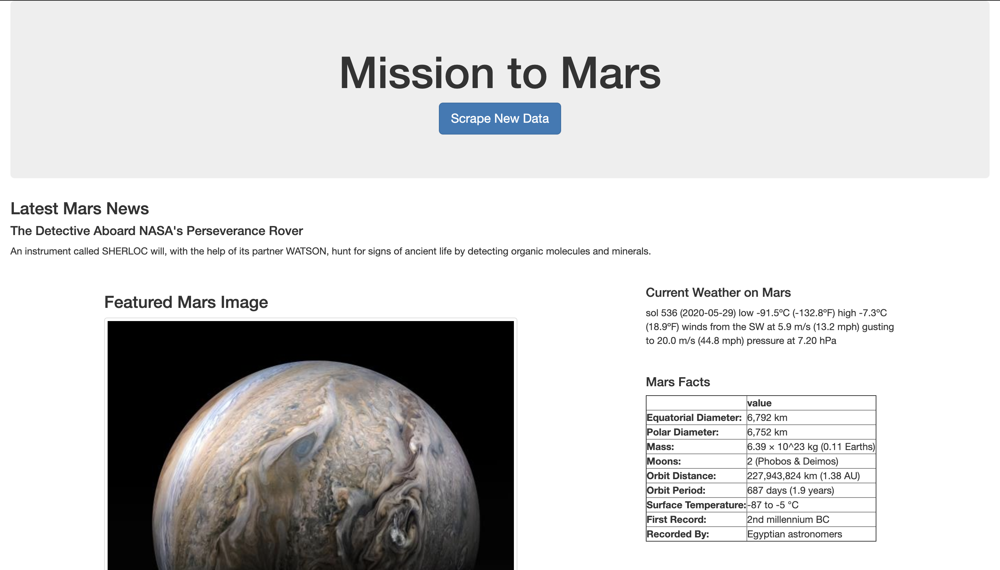
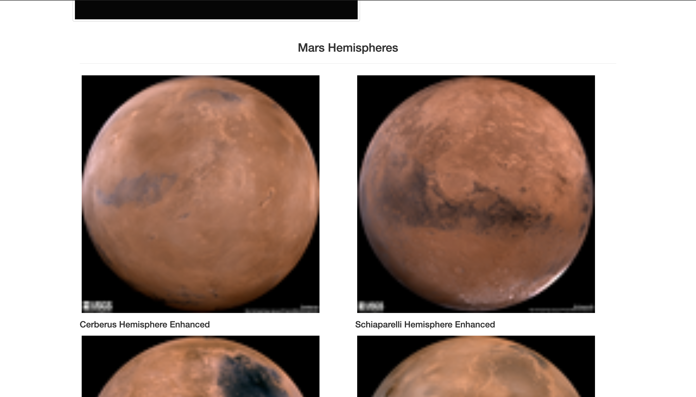
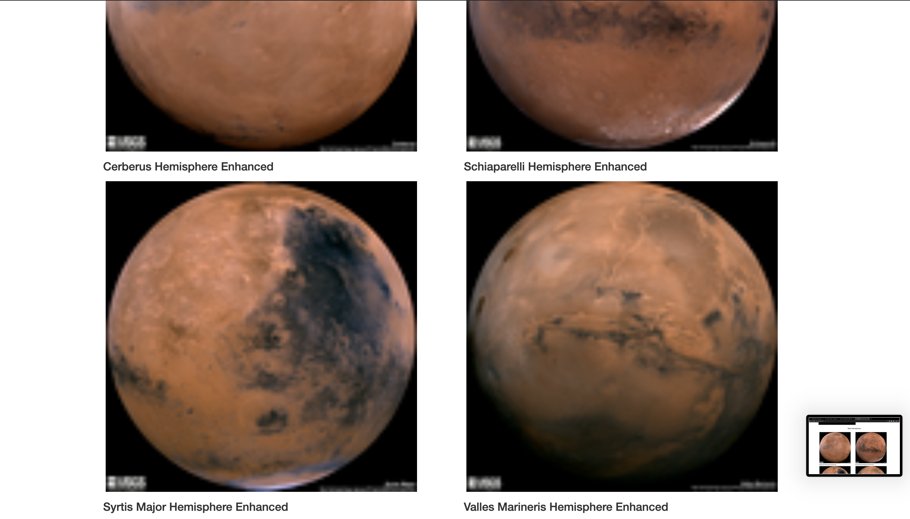

# Web-Scraping-Challenge

This challenge is to build a web application that scrapes various websites for data related to the Mission to Mars and displays the information in a single HTML page.

# Final Result

# Scraping URLs

1. [NASA Mars News Site](https://mars.nasa.gov/news/)
